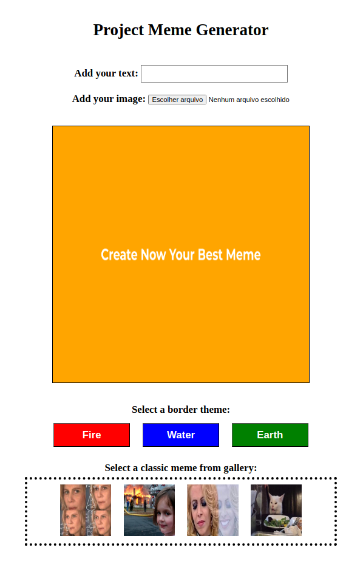

# Projeto Meme Generator

[Objetivos do projeto](#objetivos-do-projeto) | [Tecnologias utilizadas](#tecnologias-utilizadas) | [Habilidades desenvolvidas](#habilidades-desenvolvidas) | [Implementações](#implementações) | [Resultado](#resultado)

---

#### Objetivos do projeto

Nesse projeto foi desenvolvida uma página web para a criação de memes, onde é possivel fazer upload de imagens ou utilizar os modelos oferecidos.

---

#### Tecnologias utilizadas

- `HTML`
- `CSS`
- `JavaScript`

---

#### Habilidades desenvolvidas

- Manipular o DOM
- Manipular o Javascript
- Manipular o CSS

---

#### Implementações

`Requisitos obrigatórios:`
    1. Crie uma caixa de texto com a qual quem usa pode interagir para inserir texto em cima da imagem escolhida
    2. O site deve permitir que quem usa faça upload de uma imagem de seu computador
    3. Adicione uma moldura no container. A moldura deve ter 1 pixel de largura, deve ser preta e do tipo 'solid'. A área onde a imagem aparecerá deve ter fundo branco
    4. Adicione o texto que será inserido sobre a imagem deve ter uma cor, sombra e tamanho específicos
    5. Limite o tamanho do texto que o usuário pode inserir

   `Requisitos bônus:`
        6. Permita a quem usa customizar o meme escolhido acrescentando a ele uma de três bordas. A página deve ter três botões, que ao serem clicados devem cada um trocar a própria borda ao redor do container
        7. Tenha um conjunto de quatro imagens pré prontas de memes famosos para o usuário escolher. Mostre miniaturas das imagens e, mediante clique do usuário, essa imagem deve aparecer dentro da moldura do elemento de container

#### Resultado

