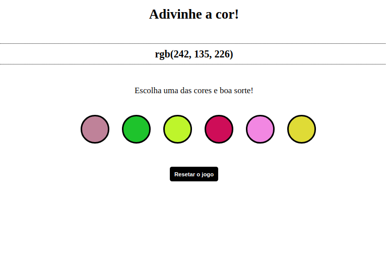

# Projeto Color Guess

[Objetivos do projeto](#objetivos-do-projeto) | [Implementações](#implementações) | [Tecnologias utilizadas](#tecnologias-utilizadas) | [Resultado](#resultado)

---

#### Objetivos do projeto

Nesse projeto foi desenvolvido um jogo de adivinhação de cores.

#### Implementações

Como jogar?

- Na tela será exibido um texto com um código RGB aleátorio a ser adivinhado
- Serão geradas 6 cores dinamicamente como opcões
- Ao selecionar uma resposta será mostrado na tela, o feedback indicando se está correto ou não
- Ao final da página existe um botão para reiniciar o jogo e gerar novas opcões

#### Tecnologias utilizadas

`HTML`
`CSS`
`JavaScript`

#### Resultado

<video width="600" controls>
    <source src="resultado-project-color-guess.mp4"type="video/mp4">
    Seu navegador não suporta a tag de vídeo.
</video>

---
