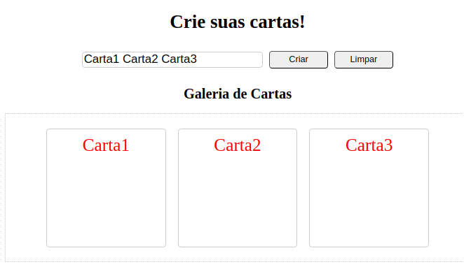

# Projeto Mistery Letter

[Objetivos do projeto](#objetivos-do-projeto) | [Tecnologias utilizadas](#tecnologias-utilizadas) | [Implementações](#implementações) | [Proxímos passos](#proximos-passos) | [Resultado](#resultado)

---

#### Objetivos do projeto

O projeto "Mistery Letter" é uma aplicação web que permite aos usuários criar cartas misteriosa

---

#### Tecnologias utilizadas

`HTML`
`CSS`
`JavaScript`

---

#### Implementações

- **Criação de Cartas**: O usuário pode digitar um texto no campo de entrada e clicar no botão "Criar" para gerar cartas com cada palavra do texto.
- **Limpeza de Cartas**: O usuário pode clicar no botão "Limpar" para remover todas as cartas geradas.
- **Validação de Entrada**: Se o campo de entrada estiver vazio, uma mensagem de erro será exibida solicitando que o usuário digite o conteúdo da carta.

---

#### Proximos passos

- Adicionar a opcao de personalizar cores e imagens de fundo
- Possibilitar adicionar imagens as cartas

---

#### Resultado

---
