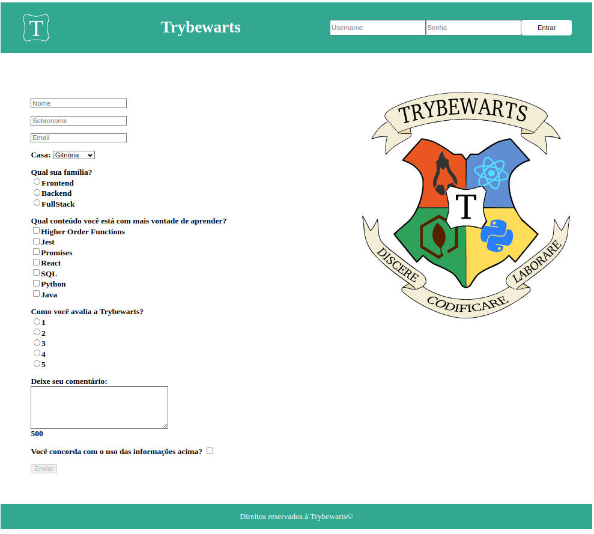
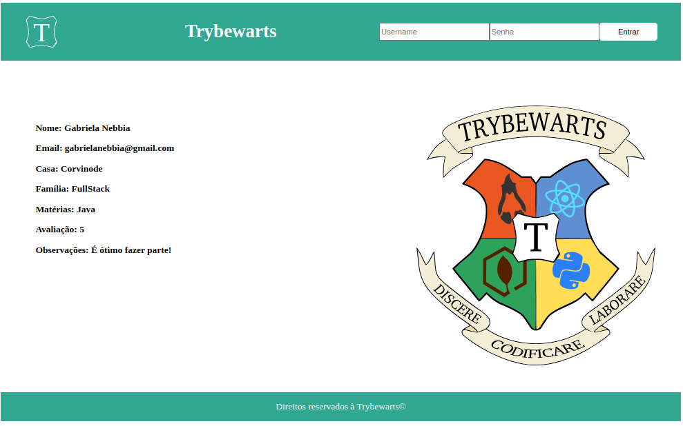

# Projeto Trybewarts

[Objetivos do projeto](#objetivos-do-projeto) | [Tecnologias utilizadas](#tecnologias-utilizadas) | [Implementações](#implementações) | [Funcionalidades](#funcionalidades) | [Resultado](#resultado)

---

#### Objetivos do projeto

Nesse projeto desenvolvido em grupo foi criada uma página de formulário da Escola Trybewarts para que os estudantes pudessem enviar feedbacks sobre a escola.

---

#### Tecnologias utilizadas

`HTML`
`CSS`
`JavaScript`

---

#### Implementações

- Formulário em HTML
- Estilização em CSS com flexbox
- Design responsivo para dispositivos móveis

---

#### Funcionalidades

- **Login Simulado**: Verificação de login com um alerta de boas-vindas ou mensagem de erro.
- **Formulário de Avaliação**: Campos para nome, sobrenome, email, casa, família, matérias preferidas, avaliação e comentários.
- **Habilitação do Botão de Envio**: O botão de envio é habilitado apenas quando o usuário concorda com os termos.
- **Contador de Caracteres**: Contador de caracteres para o campo de comentários.
- **Exibição de Dados**: Exibe os dados preenchidos pelo usuário após o envio do formulário.

---

#### Resultado
Página inicial:

Formulário enviado:

